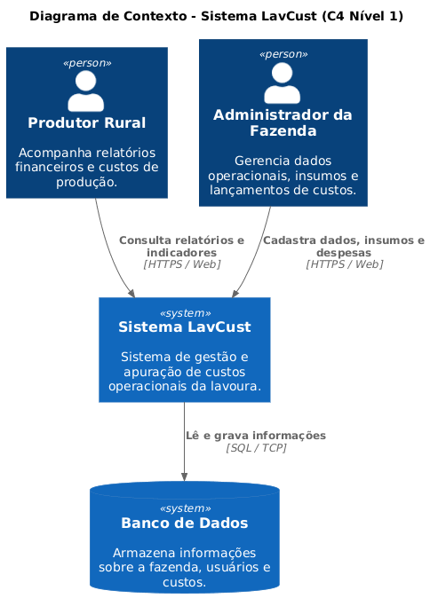
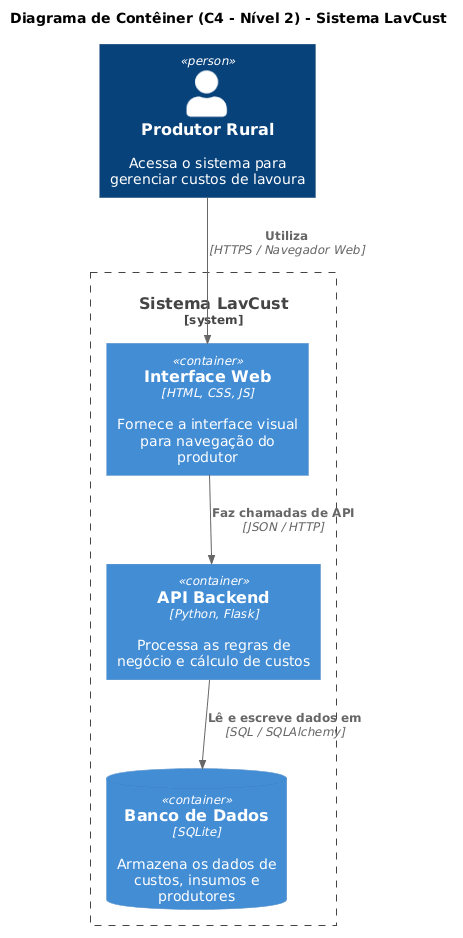
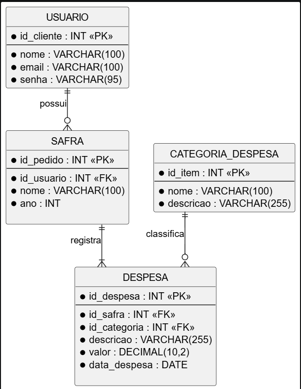
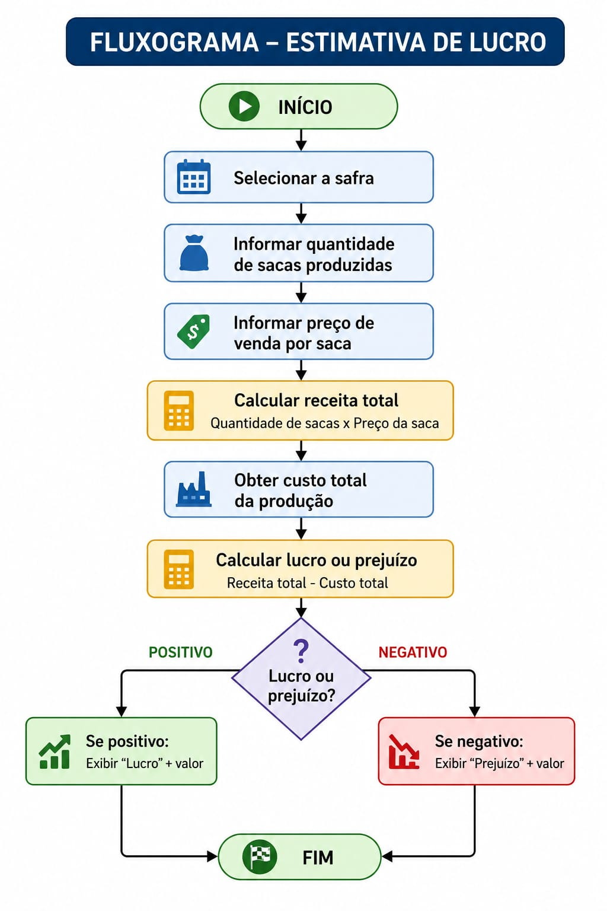

LavCust

O LavCust é um sistema desenvolvido para auxiliar agricultores e produtores rurais no controle dos custos de produção de lavouras de soja e milho. A plataforma permitirá o cadastro de despesas, como sementes, fertilizantes, defensivos, combustível, mão de obra e outros insumos, além de gerar relatórios por safra.
O sistema também possibilitará a estimativa do lucro ou prejuízo da produção com base nos custos registrados e no preço de venda da saca. Dessa forma, o LavCust busca substituir o controle manual realizado em cadernos e planilhas, proporcionando maior organização financeira, agilidade no acompanhamento dos custos e apoio à tomada de decisões.

*Integrantes:
Werica Paula
Nicoly Lopes
Beatryz dos Santos
Maria Eduarda Afonso

---

# 🏗️ Arquitetura do Sistema

Os diagramas abaixo representam a arquitetura e a estrutura técnica do projeto LavCust.

## Diagrama de Contexto (C4 - Nível 1)

**Responsável:** Werica

---

## Diagrama de Contêiner (C4 - Nível 2)

**Responsável:** Beatryz

---

## Modelo de Banco de Dados (DER)

**Responsável:** Duda

---

## Fluxograma do Processo

**Responsável:** Nicoly

